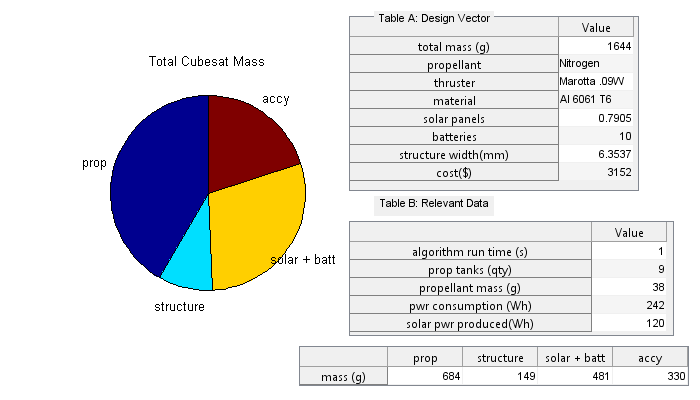

# MDO
Multidisciplinary Design Optimizer based in Matlab, for a Micro Satellite and subsystems.

## About:
* This repository is an archive for my 2016 MS thesis work on satellite design optimization.
* The work carries over nicely into robotics, having many discrete components (eg battery cells) and continuous design elements (eg gear ratios, chassis width...)
* It certainly has flaws but should serve as a proof of concept, and a framework for building an optimizer for such a system.

_Example of an auto-generated design from the optimizer_

## Future Work:
* I anticipate by this time (2023 December) we have new libraries available to write this code in python, and even utilize LLMs to convert the code swiftly, into whichever computational software is of interest.
